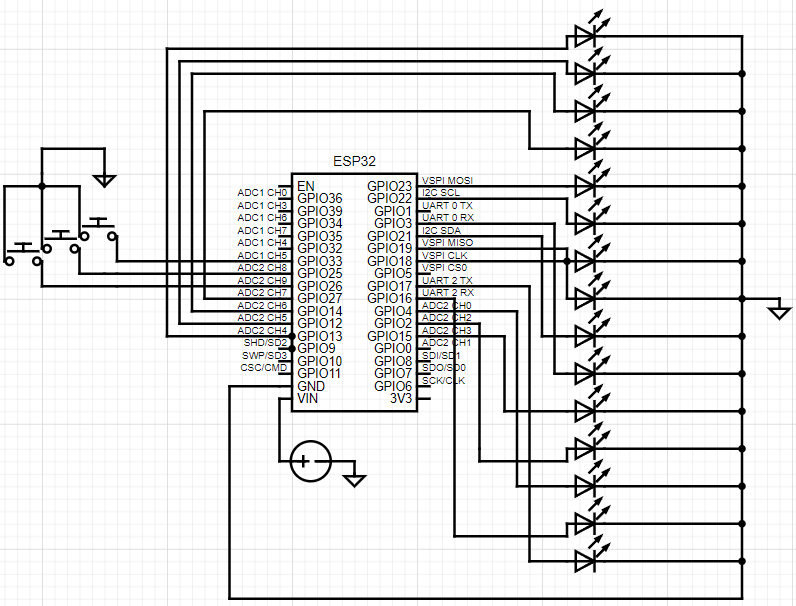

# LED Binary Calculator

## Table of Contents
1. [Project Description](#project-description)
2. [Hardware Requirements](#hardware)
3. [Software Requirements](#software)
4. [Setup](#setup)
5. [How to Run](#run)
6. [Schematic/Circuit](#schematic)
7. [Code](#code)

## Project Description

This binary calculator uses an ESP32 microcontroller to perform binary operations. It utilizes 15 LEDs to display binary values and 3 buttons to provide input. The operations supported are:

Addition
Subtraction
AND
OR

## Hardware Requirements

ESP32 Development Board
15 LEDs
3 Push Buttons
Resistors (appropriate values for LEDs and buttons)
Breadboard and jumper wires

## Software Requirements

ESP-IDF (Espressif IoT Development Framework)
A suitable code editor (e.g., Visual Studio Code)

## Setup

1. Connect the LEDs and Buttons as specfied in the code and schematic.
2. Configure the ESP-IDF (refer to the offical guide)
3. Clone the Repository
git clone https://github.com/yourusername/led-binary-calculator.git
cd led-binary-calculator
4. Build the Project
idf.py set-target esp32
idf.py build
5. Flash the Project
idf.py -p /dev/ttyUSB0 flash monitor

## How to Run

1. Power the ESP32:

Connect the ESP32 to your computer or a power source.

2. Operation:

Button 1: Increment the current value in the selected set (First Counter, Operation, or Second Counter).
Button 2: Switch between sets (First Counter, Operation, Second Counter).
Button 3: Reset all values.
Results:

3. The LEDs will display the results of the selected operation.

## Schematic/Circuit

## Code
#include <stdio.h>
#include "freertos/FreeRTOS.h"
#include "freertos/task.h"
#include "driver/gpio.h"
#include "esp_log.h"
#include "sdkconfig.h"

#define BLINK_GPIO_1 13
#define BLINK_GPIO_2 12
#define BLINK_GPIO_3 14
#define BLINK_GPIO_4 27
#define BLINK_GPIO_5 23
#define BLINK_GPIO_6 22
#define BLINK_GPIO_7 18
#define BLINK_GPIO_8 19
#define BLINK_GPIO_9 21
#define BLINK_GPIO_10 3
#define BLINK_GPIO_11 15
#define BLINK_GPIO_12 2
#define BLINK_GPIO_13 4
#define BLINK_GPIO_14 16
#define BLINK_GPIO_15 17
#define BUTTON_GPIO_1 26
#define BUTTON_GPIO_2 25
#define BUTTON_GPIO_3 33

static int gpio_pins[][2] = {
    {BLINK_GPIO_1, 0}, {BLINK_GPIO_2, 0}, {BLINK_GPIO_3, 0}, {BLINK_GPIO_4, 0},
    {BLINK_GPIO_5, 0}, {BLINK_GPIO_6, 0}, {BLINK_GPIO_7, 0}, {BLINK_GPIO_8, 0},
    {BLINK_GPIO_9, 0}, {BLINK_GPIO_10, 0},{BLINK_GPIO_11, 0}, {BLINK_GPIO_12, 0}, 
    {BLINK_GPIO_13, 0}, {BLINK_GPIO_14, 0}, {BLINK_GPIO_15, 0}
};
static const int gpio_count = sizeof(gpio_pins) / sizeof(gpio_pins[0]);

static const int gpio_pins_button[] = {BUTTON_GPIO_1, BUTTON_GPIO_2, BUTTON_GPIO_3};
static const int gpio_button_count = sizeof(gpio_pins_button) / sizeof(gpio_pins_button[0]);

static void configure_led_output(void)
{
    for (int i = 0; i < gpio_count; ++i) {
        gpio_reset_pin(gpio_pins[i][0]);
        gpio_set_direction(gpio_pins[i][0], GPIO_MODE_OUTPUT);
        gpio_set_pull_mode(gpio_pins[i][0], GPIO_PULLUP_ONLY);
        vTaskDelay(pdMS_TO_TICKS(100));
    }
    printf("LEDs Configured!\n");
}

static void configure_button_input(void)
{
    for (int i = 0; i < gpio_button_count; ++i) {
        gpio_reset_pin(gpio_pins_button[i]);
        gpio_set_direction(gpio_pins_button[i], GPIO_MODE_INPUT);
        gpio_set_pull_mode(gpio_pins_button[i], GPIO_PULLUP_ONLY);
        vTaskDelay(pdMS_TO_TICKS(100));
    }
    printf("Buttons Configured!\n");
}

void app_main(void)
{
    configure_led_output();
    configure_button_input();

    int counter = 0;
    int operation = 0;
    int second_counter = 0;
    int current_set = 0;

    while (1) {
        for (int i = 0; i < gpio_button_count; ++i) 
        {
            int level = gpio_get_level(gpio_pins_button[i]);

            if(level == 0){
                if(i == 0){
                    if (current_set == 0) {
                        counter = (counter + 1) % 16;

                        for(int bit = 0; bit < 4; bit++){
                            int bit_value = (counter >> bit) & 1;
                            gpio_pins[bit][1] = bit_value;
                            gpio_set_level(gpio_pins[bit][0], bit_value);
                        }

                        printf("Button GPIO %d is pressed (First Counter: %d)\n", gpio_pins_button[i], counter);
                    } else if (current_set == 1) {
                        operation = (operation + 1) % 4;

                        for(int bit = 0; bit < 2; bit++){
                            int bit_value = (operation >> bit) & 1;
                            gpio_pins[bit + 4][1] = bit_value;
                            gpio_set_level(gpio_pins[bit + 4][0], bit_value);
                        }

                        printf("Button GPIO %d is pressed (Operation: %d)\n", gpio_pins_button[i], operation);
                    } else if (current_set == 2) {
                        second_counter = (second_counter + 1) % 16;

                        for(int bit = 0; bit < 4; bit++){
                            int bit_value = (second_counter >> bit) & 1;
                            gpio_pins[bit + 6][1] = bit_value;
                            gpio_set_level(gpio_pins[bit + 6][0], bit_value);
                        }

                        printf("Button GPIO %d is pressed (Second Counter: %d)\n", gpio_pins_button[i], second_counter);
                    }
                }
                if(i == 1){
                    current_set = (current_set + 1) % 3;
                    printf("Button GPIO %d is pressed (Switching to set %d)\n", gpio_pins_button[i], current_set);
                }
                if(i == 2){
                    counter = 0;
                    second_counter = 0;
                    operation = 0;
                    current_set = 0;

                    for(int i = 0; i < gpio_count; i++){
                        gpio_set_level(gpio_pins[i][0],0);
                    }
                }

                // Add
                if(operation == 0){
                    int result = counter + second_counter;
                    for(int bit = 0; bit < 5; bit++){
                        int bit_value = (result >> bit) & 1;
                        printf("Bit Value %d : ",bit_value);
                        gpio_pins[bit+10][1] = bit_value;
                        gpio_set_level(gpio_pins[bit+10][0], bit_value);
                    }
                }
                // Sub
                else if(operation == 1){
                    int result = counter - second_counter;
                    int negative = 0;

                    if(result < 0){
                        negative = 1;
                        result = -result;
                    }

                // Ensure result is within 4-bit range
                result &= 0x0F;

                // Set the leftmost bit to the negative flag
                result |= (negative << 4);

                for(int bit = 0; bit < 5; bit++){
                    int bit_value = (result >> bit) & 1;
                    gpio_pins[bit+10][1] = bit_value;
                    gpio_set_level(gpio_pins[bit+10][0], bit_value);
                }
                }
                // AND
                else if(operation == 2){
                    for(int bit = 0; bit < 4; bit++){
                        int bit_value_1 = (counter >> bit) & 1;
                        int bit_value_2 = (second_counter >> bit) & 1;
                        int bit_value_3 = bit_value_1 & bit_value_2;
                        gpio_pins[bit+10][1] = bit_value_3;
                        gpio_set_level(gpio_pins[bit+10][0], bit_value_3);
                    }
                }
                // OR
                else if(operation == 3){
                    for(int bit = 0; bit < 4; bit++){
                        int bit_value_1 = (counter >> bit) & 1;
                        int bit_value_2 = (second_counter >> bit) & 1;
                        int bit_value_3 = bit_value_1 | bit_value_2;
                        gpio_pins[bit+10][1] = bit_value_3;
                        gpio_set_level(gpio_pins[bit+10][0], bit_value_3);
                    }

                }
                printf("Operation %d : ",operation);

                vTaskDelay(pdMS_TO_TICKS(500));
            }
        }
        vTaskDelay(pdMS_TO_TICKS(10));
    }
}
